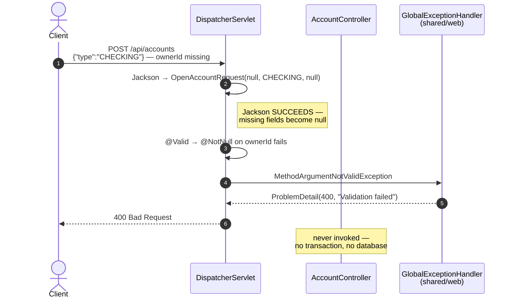
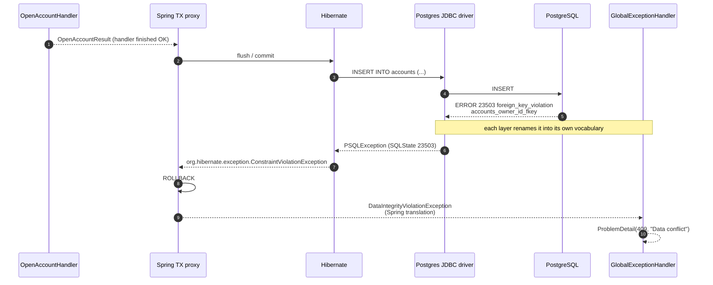
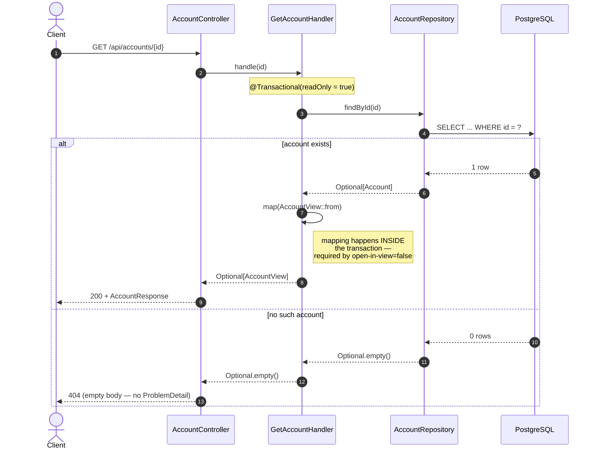
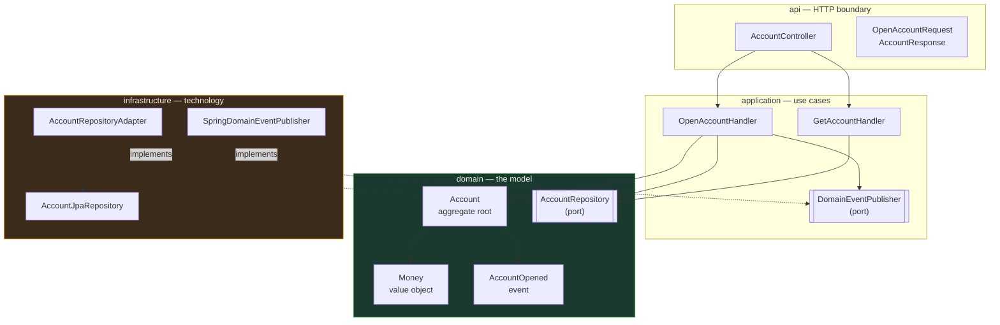

# 19 Request Flow — slice 1 sequence diagrams

How a request actually travels through the accounts slice. Diagrams render on
GitHub and in most Markdown viewers.

Layer legend used throughout:
**api** → **application** → **domain** ← **infrastructure**

---

## 1. Open account — happy path

```mermaid
sequenceDiagram
    autonumber
    actor Client
    participant MVC as DispatcherServlet
    participant Ctrl as AccountController<br/>(api)
    participant Proxy as Spring TX proxy
    participant H as OpenAccountHandler<br/>(application)
    participant Agg as Account<br/>(domain)
    participant Port as AccountRepository<br/>(domain port)
    participant Adp as RepositoryAdapter<br/>(infrastructure)
    participant HB as Hibernate
    participant DB as PostgreSQL

    Client->>MVC: POST /api/accounts
    MVC->>MVC: Jackson → OpenAccountRequest
    MVC->>MVC: @Valid → Bean Validation
    Note right of MVC: a failure here → 400,<br/>handler is never reached

    MVC->>Ctrl: open(request)
    Ctrl->>Ctrl: new OpenAccountCommand(...)
    Ctrl->>Proxy: handle(command)

    Note over Proxy,DB: BEGIN TRANSACTION

    Proxy->>H: handle(command)

    H->>H: uniqueAccountNumber()
    H->>Port: existsByAccountNumber(candidate)
    Port->>Adp: (implements the port)
    Adp->>HB: derived query
    HB->>DB: SELECT 1 FROM accounts WHERE account_number = ?
    DB-->>HB: no rows
    HB-->>H: false

    H->>Agg: Account.open(ownerId, type, currency, number)
    Note right of Agg: INVARIANTS enforced here:<br/>owner/type/number required,<br/>id = UUID.randomUUID(),<br/>status = ACTIVE,<br/>balance = Money.zero
    Agg-->>H: account

    H->>Port: save(account)
    Port->>Adp: (implements the port)
    Adp->>HB: save
    Note right of HB: INSERT is only SCHEDULED —<br/>no SQL sent yet
    HB-->>H: account

    H->>H: events.publish(AccountOpened)
    Note right of H: synchronous, in-transaction;<br/>no listeners exist yet

    H-->>Proxy: OpenAccountResult

    Note over Proxy,DB: COMMIT → Hibernate flushes
    Proxy->>HB: flush
    HB->>DB: INSERT INTO accounts (...)
    Note right of DB: FK on owner_id is checked HERE
    DB-->>HB: 1 row
    HB-->>Proxy: ok

    Proxy-->>Ctrl: OpenAccountResult
    Ctrl->>Ctrl: AccountResponse.from(result)
    Ctrl-->>MVC: ResponseEntity 201 + Location
    MVC->>MVC: Jackson → JSON
    MVC-->>Client: 201 Created
```

**The three moments worth memorizing**

1. **Step 4** — validation runs *before* the controller body. Bad input never
   reaches your business logic.
2. **Step 18** — `save()` does **not** send SQL. It schedules the INSERT.
3. **Steps 24–26** — the INSERT is sent at **commit**, *after* the handler has
   returned. This is why a `try/catch` inside the handler can't catch a
   constraint violation, and why `saveAndFlush` exists.

---

## 2. Validation failure → 400



---

## 3. Unknown owner → 409 (the translation chain)



**Why five names for one error:** each layer translates so the layer above
doesn't need to know the one below. Your `GlobalExceptionHandler` catches a
database-neutral Spring type — it never sees Postgres error codes, so the same
code would work on MySQL.

**Where the detail lives:** only the Postgres `DETAIL` line names the actual
offending value and table. By the time it reaches your handler that specificity
is gone — which is why debugging means going *down* the chain.

---

## 4. Get account — found and not found



Note the asymmetry: the 404 is produced inline with
`ResponseEntity.notFound()`, so unlike every other error it has **no
`ProblemDetail` body**. Introducing `AccountNotFoundException` in slice 2 would
make all error responses consistent.

---

## 5. The dependency picture

Sequence diagrams show *time*. This shows *who is allowed to know about whom*:



**Read the arrows:** everything points *toward* `domain`. `infrastructure`'s
arrows are dashed because they're **implements** relationships — the adapter
depends on the port the domain declared, which is why the arrow points inward
even though data flows outward at runtime.

That inversion is the whole architecture in one picture, and it's what ArchUnit
rules 1 and 2 enforce.

---

## Study prompts

Cover the diagrams and answer these:

1. At which step does the INSERT actually reach Postgres — and why not earlier?
2. Which component knows that the owner doesn't exist? Why can't `Account` check it?
3. Why does the exception get renamed five times on the way up?
4. In diagram 4, why must `AccountView::from` run inside the transaction?
5. In diagram 5, why do the infrastructure arrows point *inward*?
6. Where would `@TransactionalEventListener(AFTER_COMMIT)` insert itself in diagram 1?
