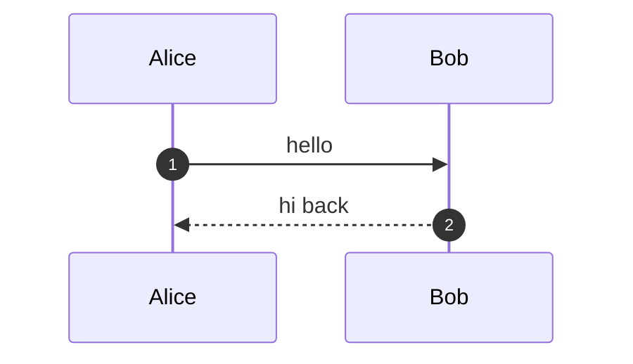
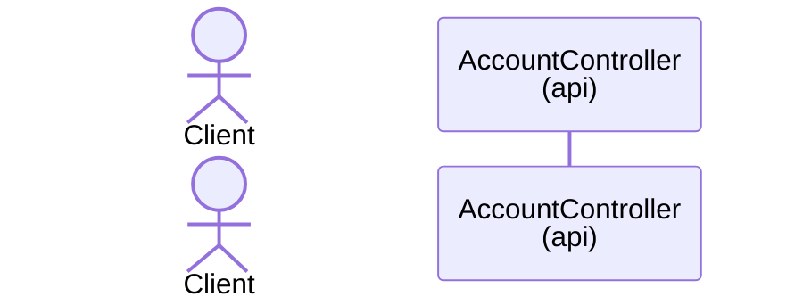
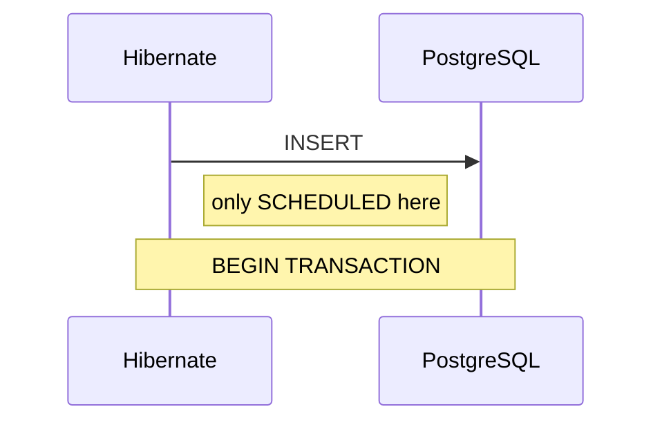
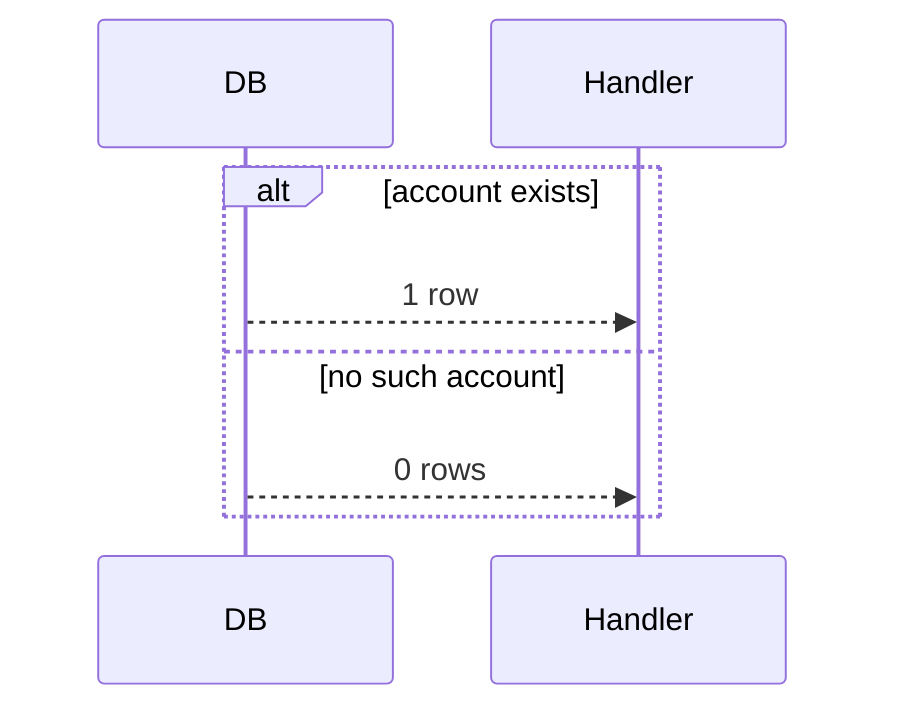
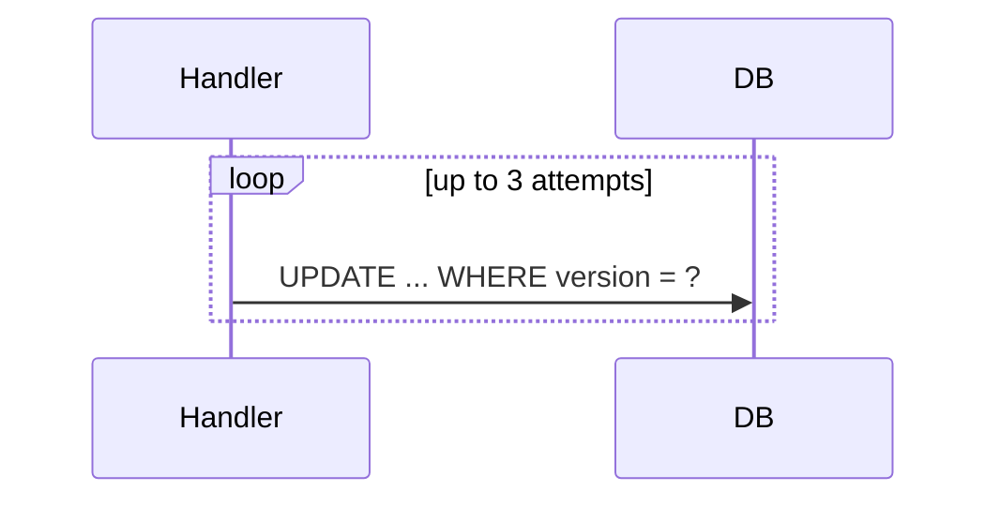
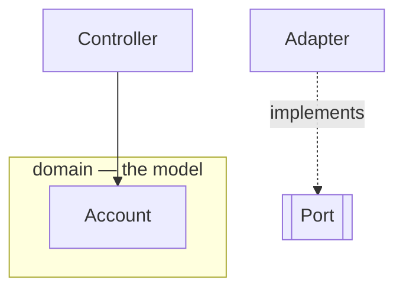
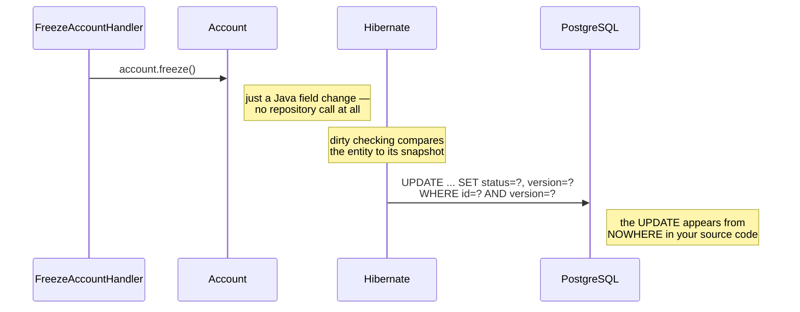
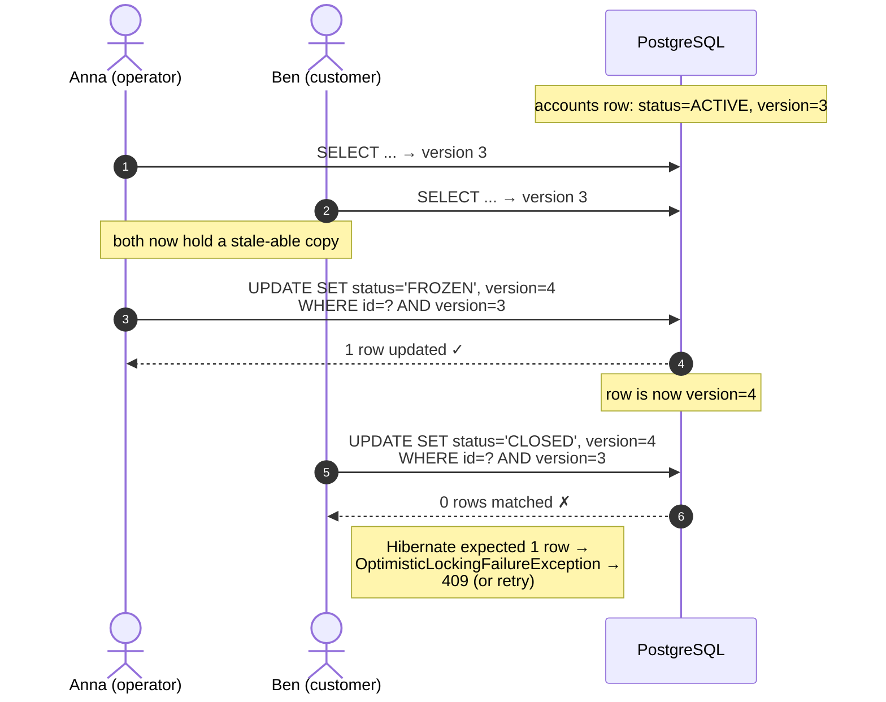

# 20 How to Draw These Diagrams

A guide to producing [docs/19-request-flow.md](19-request-flow.md) style diagrams
yourself, for slice 2 and beyond. Mermaid only — it's plain text, renders on
GitHub, and lives in git next to the code it describes.

---

## Part 1 — Mermaid syntax you actually need

### The skeleton

Every sequence diagram is a fenced block:

````markdown

````

`autonumber` adds step numbers — always use it, so you can write "at step 18…"
in your prose.

### Declaring participants



- `actor` draws a stick figure — use it for the human/client.
- `participant` draws a box — everything else.
- `as` gives a short id (`Ctrl`) plus a display label. **Always use short ids**;
  you'll type them on every line.
- `<br/>` makes a line break inside a label — how the layer name gets onto the
  second line.

**Order matters:** participants appear left-to-right in declaration order.
Declare them in the order the request travels, so arrows mostly point rightward
and the diagram reads like a waterfall.

### The four arrows

```
A->>B:  solid arrow      — a call
B-->>A: dashed arrow     — a return
A->>A:  self-call        — work inside one component
A-)B:   open arrow       — async (fire and forget)
```

Rule of thumb: `->>` going down, `-->>` coming back. Don't draw a return for
every call — only where the returned value matters to the story.

### Notes — where the teaching happens



- `Note right of X` / `Note left of X` — attached to one participant
- `Note over X,Y` — spans two, good for transaction boundaries

**Notes are the most valuable part of your diagram.** The arrows show *what*
happens; notes explain *why it matters*. If a diagram has no notes, it's a
picture rather than a lesson.

### Branching



`alt`/`else`/`end` for either-or. Also available: `opt` (maybe happens),
`loop` (repeats), `par` (in parallel).

Use `loop` for slice 2's retry logic:



### Flowcharts, for the dependency view

Different diagram type, for structure rather than time:

````markdown

````

- `TB` = top-to-bottom (`LR` = left-to-right)
- `[Text]` = box, `[["Text"]]` = subroutine shape — good for ports/interfaces
- `-.label.->` = dashed arrow with a label, for *implements*
- `subgraph` groups boxes into a labelled cluster

---

## Part 2 — How to decide what to draw

### Rule 1: one diagram per outcome, not one per feature

Slice 1 has two use cases and four diagrams: happy path, 400, 409, and get.
That's deliberate. **Cramming every branch into one diagram makes it
unreadable**, and the error paths are where the interesting mechanics live.

For slice 2, plan for:

| diagram | why it earns its place |
|---|---|
| freeze — happy path | shows an **UPDATE** flow, which slice 1 never had |
| freeze — wrong state (409) | the aggregate rejecting a transition |
| freeze — account not found (404) | your new `AccountNotFoundException` path |
| optimistic-lock collision | two actors racing — genuinely new |
| close — non-zero balance | a second invariant, briefly |

If a diagram would be identical to another with one label changed, skip it.
Unfreeze is freeze with different words — don't draw it.

### Rule 2: pick participants at one level of abstraction

Slice 1's main diagram uses 9 participants. That's near the limit. Mixing
levels ("DispatcherServlet" next to "the database") is fine *if* every
participant is a thing you'd point at in the code.

**Don't include:** Jackson, Hikari, the servlet container internals. Collapse
them into a self-call or a note on the participant that owns them:

```
MVC->>MVC: Jackson → OpenAccountRequest
```

**Do include:** the **Spring TX proxy**. It's invisible in your source but it's
where transactions begin and commit — leaving it out hides the single most
important timing fact.

### Rule 3: draw the thing the code hides

This is the whole point. Ask: *what does a reader get wrong from reading the
source?*

For slice 1 that was **`save()` doesn't send SQL** — invisible in code, obvious
in the diagram.

For slice 2 it's **`freeze()` needs no `save()` at all**. Draw that explicitly:



That last note is the lesson. Someone reading `FreezeAccountHandler` sees no
save and no SQL — the diagram is where dirty checking becomes visible.

### Rule 4: annotate the invariant, don't hide it in a call

Weak:

```
H->>Agg: freeze()
Agg-->>H: ok
```

Strong:

```
H->>Agg: account.freeze()
Note right of Agg: INVARIANT: status must be ACTIVE<br/>else IllegalStateException
```

The reason `freeze()` lives on the aggregate is invisible unless you write it
down. Same for `Money.zero`, the balance-must-be-zero rule in `close()`, and the
FK check in the database.

---

## Part 3 — A worked start for slice 2

Here's the optimistic-lock diagram, which is the genuinely new one. Study how it
uses two actors and `alt`:



Notice what makes it work: **two actors on the same participant**, a note
showing the row's state changing between them, and the `0 rows` return as the
punchline.

---

## Part 4 — Workflow

**Write it after the code, not before.** A diagram drawn from imagination
documents what you *intended*; one drawn from working code documents what
*is*. Trace your own `FreezeAccountHandler` line by line as you draw.

**Preview as you go.** [mermaid.live](https://mermaid.live) renders instantly
and reports syntax errors with a line number. Paste, edit, paste back.

**Verify it against the code before committing.** Ask of every arrow: does this
call actually exist? Is this participant a real class? A diagram that quietly
drifts from the code is worse than none — reviewers trust it and get misled.

**Keep these tracked in git.** Unlike the study decks, request-flow diagrams are
real project documentation. They're also one of the fastest ways for an
interviewer to see that you can explain a system, not just write one.

---

## Checklist for each new diagram

- [ ] `autonumber` on, so prose can reference step numbers
- [ ] Participants declared in request order, with short ids
- [ ] The Spring TX proxy included wherever a transaction exists
- [ ] Every participant is a class or system you could open in the IDE
- [ ] At least one note explaining something the source code hides
- [ ] Invariants annotated where they're enforced
- [ ] Error paths as separate diagrams, not `alt` branches in the happy path
- [ ] Rendered and checked at mermaid.live
- [ ] Every arrow traced against the real code
